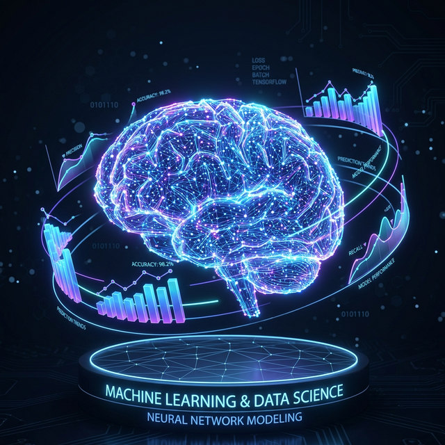

# Lab 3: NumPy Operations & Data Visualization

## Overview (Roman Urdu Mein)
Is lab mein humne **NumPy** library ka istemal karte huye data manipulation aur analysis seekha hai. NumPy industry mein base layer ki tarah kaam karti hai aur AI models ke backend par yahi mathematics chal rahi hoti hai.

### Humne Kya Kya Kiya (Practical Tasks):
1. **Task 12 (Arrays Creation)**: 1D, 2D, aur 3D arrays banaye.
2. **Task 13 (Indexing & Reshaping)**: Slicing aur array ki shakal badalna seekha.
3. **Task 14 (Maths & Broadcasting)**: Element-wise operations aur scaling seekhi.
4. **Task 15 (Statistical Functions)**: Mean, Median, aur Standard Deviation nikaala.
5. **Task 16 (Linear Algebra)**: Matrix Multiplication (Dot Product) perform kiya.
6. **Task 17 (Random Sampling)**: Random numbers generate kiye.

---

## 📸 Lab Execution Screenshots

### 1. Stock Price Graph & Tasks

### 2. Array Indexing & Slicing

### 3. Statistical Analysis

### 4. Random Generation & Sampling

---

### Final Deliverable Summary:
Humne ek **Stock Price Visualization** chart banaya jo real-world prediction ki ek choti si simulation hai. Humne proof kiya ke NumPy normal Python lists se **10x se 100x tak fast** hai.

---

## Task 15: Interesting Questions for Teacher (Mam Naseeha)
1. **Outliers Impact**: "Mam, agar humare data mein koi extreme value aa jaye, toh **Mean** bohot change ho jata hai lekin **Median** stable rehta hai. Toh kya humein hamesha Median use karna chahiye?"
2. **Standard Deviation in Prediction**: "Mam, agar **Standard Deviation** bohot zyada ho, toh kya iska matlab ye hai ke hamara AI model predict karte huye zyada ghalati kare ga?"
3. **Explainable AI (XAI)**: "Mam, kya hum NumPy aur Statistics ko use kar ke AI ke 'Black Box' decisions ko justify kar sakte hain?"

---

Developed with ⚡ by Muhammad Usman Ray

---

Developed with ⚡ by Muhammad Usman Ray
