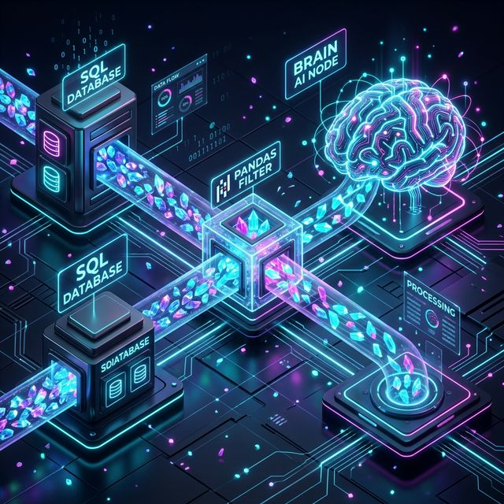
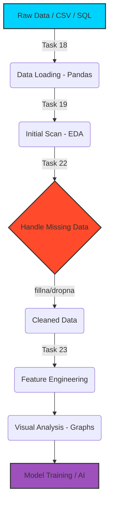

# Lab 4: Data Analysis & Visualization (Titanic Dataset)

## 📊 Data Engineering Pipeline
Mera industrial workflow kasy kaam karta hai (Flowchart):

## Overview (Roman Urdu Mein)
Is lab mein humne **Pandas** library ke zariye real-world data handling aur visualization seekhi hai. Titanic dataset use karne ka maqsad ye tha ke hum samajh sakein ke kasy gande (messy) data ko AI model ke liye tayaar kiya jata hai aur graphs ke zariye trends kasy dekhte hain.

### Tasks Performed:
1. **Task 18-19**: Data loading aur initial exploration (`head`, `shape`).
2. **Task 20**: Boolean Filtering (Gender based survivors).
3. **Task 21**: Sorting (Ticket Price aur Age order).
4. **Task 22**: Handling Missing Data (`fillna` for age).
5. **Task 23**: Column Manipulation (Family size calculation aur renaming).
6. **Visualization**: Gender-wise survival chart aur Age distribution histogram.

---

## 🤖 ML Engineer & Data Scientist Workflow
Ye wo "Step-by-Step" plan hai jo modern industry mein use hota hai (Roman Urdu Summary):

1. **Data Load Karna**: Sab se pehla kaam data ko system mein lana hai (Pandas DataFrame).
2. **Initial Data Scan (EDA)**: Data ka checkup karna ke kitne rows/columns hain aur kahan kahan data missing hai.
3. **Missing Data Handle Karna**: Khaali jaghon ko `Mean` se bharna ya ghalat rows ko delete karna.
4. **Data Cleaning**: Duplicates hato, errors theek karo aur data types ko set karo.
5. **Feature Engineering**: Mojooda columns se neye aur smart columns banana (e.g., Age from DOB).
6. **Data Visualization**: Graphs bana kar "Patterns" dekhna (e.g., "Ameer log zyada bache?").
7. **Model Training & Evaluation**: Data ko Train/Test mein baant-na aur AI model train karna.

---

### Live Lab on Google Colab:
[View Lab 4 Notebook on Colab](https://colab.research.google.com/drive/1KBhZIJoDtIp5F-5zNpE-NFqz9s0MDs-a#scrollTo=hZASneOdjoOq)

---

Developed with ⚡ by Muhammad Usman Ray
